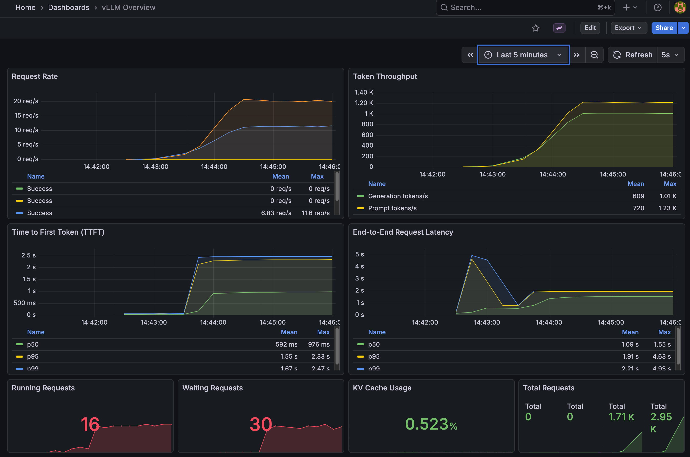
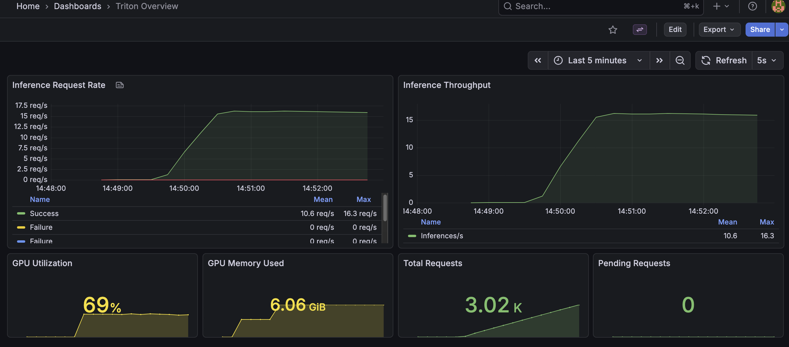

# llm-observability-pack

A ready-to-run observability stack for LLM inference servers. Supports **vLLM**, **NVIDIA Triton (vLLM backend)**, and **Triton (TensorRT-LLM backend)** with a single command switch. Includes Prometheus metrics collection, pre-configured Grafana dashboards, and load testing tools to generate traffic and visualize key LLM performance indicators.

Features:
- **Three backend options** — vLLM, Triton+vLLM, or Triton+TensorRT-LLM via Docker Compose profiles
- **Pre-provisioned dashboards** — Grafana dashboards auto-load on startup
- **Load testing tools** — generate realistic traffic to populate metrics
- **GPU monitoring** — track utilization, memory, and inference throughput

## Stack

- **vLLM** — OpenAI-compatible inference server with Prometheus metrics
- **Triton (vLLM)** — NVIDIA Triton Inference Server with vLLM backend
- **Triton (TensorRT-LLM)** — NVIDIA Triton with TensorRT-LLM for maximum GPU optimization
- **Prometheus** — scrapes and stores metrics from inference servers
- **Grafana** — pre-provisioned dashboards for monitoring LLM performance

## Key Indicators

- **TTFT** — time to first token (streaming responsiveness)
- **Inter-token latency** — token generation cadence
- **Throughput** — requests/sec and tokens/sec
- **KV Cache usage** — memory pressure indicator

## SLOs

- Availability: 99.9% successful responses
- Responsiveness: p95 TTFT ≤ 2.0s for small prompts
- Token cadence: p95 inter-token latency ≤ 150ms

## Requirements

- Docker with NVIDIA Container Toolkit
- NVIDIA driver 580+ (for CUDA 13.0 support)
- GPU with compute capability >= 7.0 (RTX 20xx or newer)
- Python 3.10+ (for TensorRT-LLM testing scripts)

Verify GPU:
```bash
nvidia-smi  # should show Driver 580+ and CUDA 13.0
```

### Python Environment (for TensorRT-LLM testing)

The TensorRT-LLM test scripts require Python dependencies for client-side tokenization:

```bash
python3 -m venv .venv
source .venv/bin/activate
pip install -r requirements-triton-trt.txt
```

## Quick Start

```bash
cp deploy/env.example deploy/.env  # configure model and settings
make up-vllm                       # start vLLM stack
# or
make up-triton                     # start Triton (vLLM backend) stack
# or
make compile-triton-trt                # compile model for TensorRT-LLM (one-time)
make up-triton-trt              # start Triton (TensorRT-LLM backend) stack

make logs                          # view logs
make down                          # stop services
```

## Services

### vLLM Stack
| Service | URL |
|---------|-----|
| vLLM API | http://localhost:8000 |
| vLLM docs | http://localhost:8000/docs |
| vLLM metrics | http://localhost:8000/metrics |
| Prometheus | http://localhost:9090 |
| Grafana | http://localhost:3000 (admin/admin) |

### Triton Stack (vLLM backend)
| Service | URL |
|---------|-----|
| Triton HTTP API | http://localhost:8000 |
| Triton gRPC API | http://localhost:8001 |
| Triton metrics | http://localhost:8002/metrics |
| Prometheus | http://localhost:9090 |
| Grafana | http://localhost:3000 (admin/admin) |

### Triton Stack (TensorRT-LLM backend)
| Service | URL |
|---------|-----|
| Triton HTTP API | http://localhost:8000 |
| Triton gRPC API | http://localhost:8001 |
| Triton metrics | http://localhost:8002/metrics |
| Prometheus | http://localhost:9090 |
| Grafana | http://localhost:3000 (admin/admin) |

## Testing

Test API with sample requests:
```bash
make test-vllm           # test vLLM API
make test-triton         # test Triton (vLLM backend) API
make test-triton-trt  # test Triton (TensorRT-LLM backend) API
```

## Load Testing

Generate continuous traffic to populate dashboards:

### vLLM
```bash
make load-test                  # default: 3 concurrent workers
make load-test CONCURRENCY=5    # custom concurrency
./scripts/load-test.sh 5        # or run directly
```

### Triton (vLLM backend)
```bash
make load-test-triton                  # default: 3 concurrent workers
make load-test-triton CONCURRENCY=5    # custom concurrency
./scripts/load-test-triton.sh 5        # or run directly
```

### Triton (TensorRT-LLM backend)
```bash
make load-test-triton-trt                  # default: 3 concurrent workers
make load-test-triton-trt CONCURRENCY=5    # custom concurrency
./scripts/load-test-triton-trt.sh 5        # or run directly
```

Press `Ctrl+C` to stop.

## TensorRT-LLM Setup

> ⚠️ **GPU Requirement:** TensorRT-LLM 0.16.0 requires **Ampere or newer** GPUs (RTX 30xx, RTX 40xx, A100, H100). Turing GPUs (RTX 20xx) are **not supported** — the pre-compiled CUDA kernels don't include SM 7.5 binaries.

TensorRT-LLM provides maximum GPU optimization but requires additional setup compared to vLLM.

### GPU Requirements

- ✅ **RTX 30xx** (Ampere, SM 8.6) — fully supported
- ✅ **RTX 40xx** (Ada Lovelace, SM 8.9) — fully supported
- ✅ **A100/H100** (SM 8.0/9.0) — fully supported
- ❌ **RTX 20xx** (Turing, SM 7.5) — not supported by TensorRT-LLM 0.16.0

### Compilation

TensorRT-LLM requires a one-time model compilation step. The compilation produces GPU-specific engine files optimized for your hardware.

```bash
# Compile with default settings (Qwen2.5-1.5B-Instruct)
make compile-triton-trt

# Custom settings
make compile-triton-trt MODEL_NAME=Qwen/Qwen2.5-1.5B-Instruct MAX_BATCH_SIZE=8 MAX_INPUT_LEN=1024 MAX_OUTPUT_LEN=1024
```

The compilation:
1. Clones TensorRT-LLM examples from GitHub
2. Downloads the model from HuggingFace
3. Converts to TensorRT-LLM checkpoint format
4. Builds optimized TensorRT engine files

Engine files are written to `serving/triton-trt/model_repository/qwen/1/`.

### Client-Side Tokenization

Unlike vLLM, the TensorRT-LLM Triton backend expects **pre-tokenized input** (token IDs, not text). The test and load-test scripts handle this automatically using the `transformers` library.

Make sure to activate the Python venv before testing:
```bash
source .venv/bin/activate
make test-triton-trt
```

## Grafana Dashboards

Access Grafana at http://localhost:3000 (login: admin/admin).

### vLLM Overview



- Request rate (success/failure)
- Token throughput (generation + prompt tokens/s)
- Time to First Token (TTFT) — p50/p95/p99
- End-to-end request latency — p50/p95/p99
- Running/waiting requests
- KV cache usage

### Triton Overview



- Inference request rate (success/failure)
- Inference throughput
- GPU utilization
- GPU memory used
- Total requests
- Pending requests

## Prometheus Integration

Verify Prometheus is scraping metrics:

1. **Check targets** — http://localhost:9090/targets
   - `vllm`, `triton`, or `triton-trt` target should show as "UP"

2. **Query metrics**:
   ```bash
   # vLLM metrics
   curl -s "http://localhost:9090/api/v1/label/__name__/values" | grep vllm

   # Triton metrics
   curl -s "http://localhost:9090/api/v1/label/__name__/values" | grep nv_
   ```

3. **Example vLLM metrics** (note the colon in metric names):
   - `vllm:request_success_total`
   - `vllm:prompt_tokens_total`
   - `vllm:generation_tokens_total`
   - `vllm:time_to_first_token_seconds`
   - `vllm:kv_cache_usage_perc`

4. **Example Triton metrics**:
   - `nv_inference_request_success`
   - `nv_inference_request_failure`
   - `nv_inference_count`
   - `nv_inference_pending_request_count`
   - `nv_gpu_utilization`
   - `nv_gpu_memory_used_bytes`

## TODO

The following items could not be fully tested due to GPU architecture limitations (RTX 2070 / Turing):

- [ ] **TensorRT-LLM end-to-end testing** — requires Ampere+ GPU (RTX 30xx or newer)
- [ ] **TensorRT-LLM Grafana dashboard** — create dashboard once TRT-LLM is verified working
- [ ] **TensorRT-LLM load testing validation** — verify load-test scripts produce expected metrics
- [ ] **Performance comparison** — benchmark vLLM vs Triton+vLLM vs Triton+TensorRT-LLM